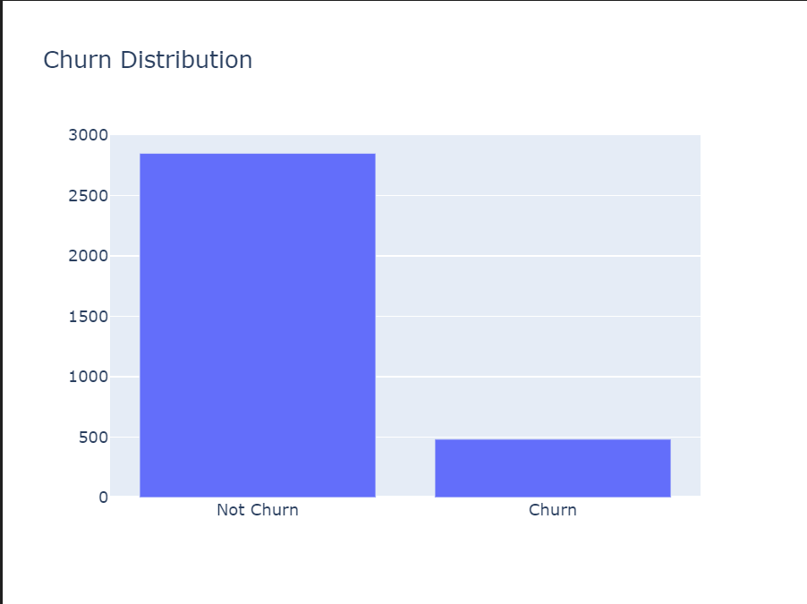
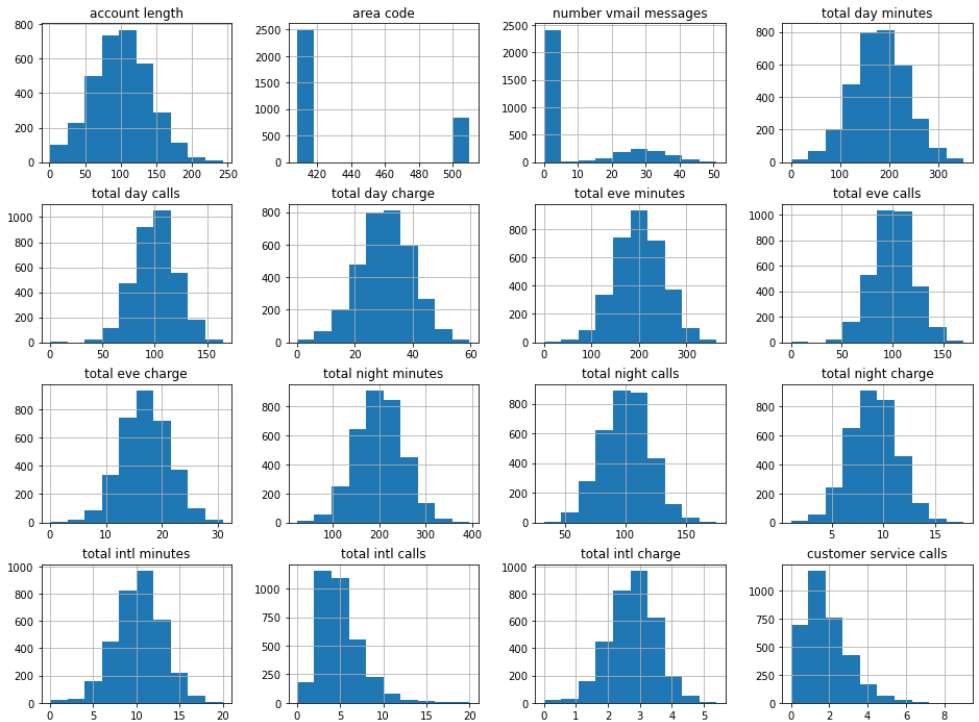
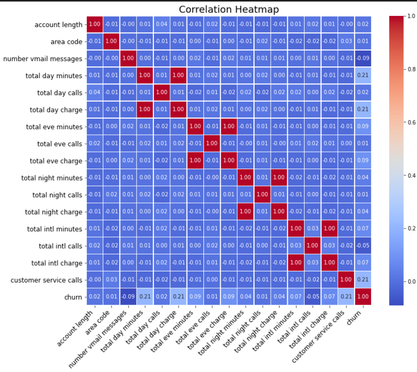
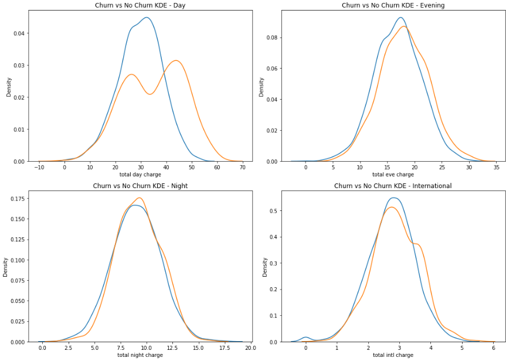
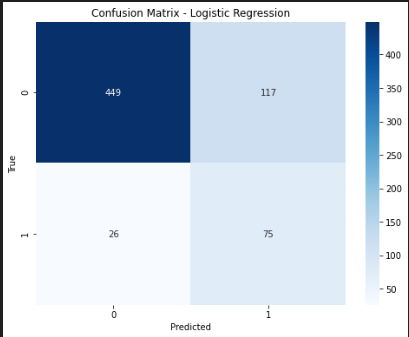
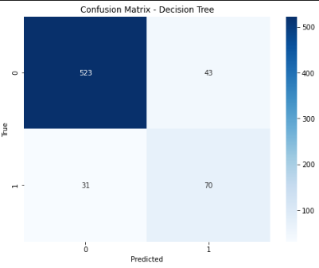
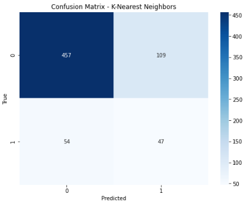
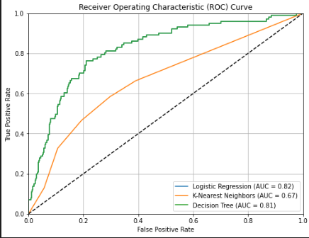
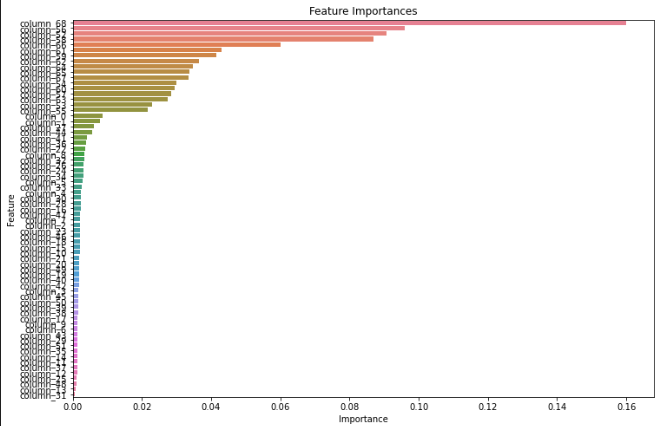
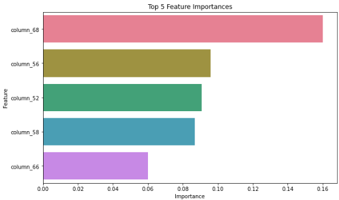

# Phase-3-project-
# Final phase 03 Project Submission

* Student name: Ingavi Kilavuka
* Student pace: full time
* Dataset: SyriaTel Customer Churn
* Instructor name: Mwikali 
# Executive summary
The project's objective is to utilize data analytics and machine learning methods to improve customer experiences and decrease churn for Syriatel, a top mobile network provider in Syria. In the competitive telecommunications sector, retaining current customers and ensuring their satisfaction are crucial for Syriatel's long-term success and growth. The goals of this project include:
- Determining whether customers are indeed leaving
- How can we best predict the amount of customers leaving
- How can this data assist Syriatel improve customer satisfaction 
## Table of contents 
1. [Business Understanding](#1-business-understanding)
    1. [About Syriatel](#11-about-syriatel)
    1. [Stakeholders](#12-stakeholders)
    1. [Business Problem](#13-business-problem)
    1. [Objectives](#14-objectives)
2. [Data Understanding](#2-data-understanding)
    1. [Data Cleaning](#21-data-cleaning)
3. [EDA](#3-eda)
    1. [Univariate analysis](#31-univariate-analysis)
    2. [Bivariate analysis](#32-bivariate-analysis)
    3. [Encoding](#33-encoding)
                    (1.[Label Encoder](#331-label-encoding))
                    (2.[One-Hot Encoder](#332-one-hot-encoding))
4. [Modeling](#4-modeling)
    1. [Logistic Regression](#41-logistic-regression)
    2. [Decision Tree](#42-decision-tree)
    3. [Random Forest](#43-random-forest)
    4. [KNN](#44-k-nearest-neighbors)
    5. [Roc Curve](#45-roc-curve)
    6. [Feature Importances](#46-feature-importance-all-features)
5. [Evaluation & Recommendations](#5-evaluation--recommendations)
    1. [Churn Preditions](#51-churn-prediction)
    2. [Churn Mitigation](#52-churn-mitigation)
    3. [Other Recommendations](#53-other-recommendations)
    # 1. Business understanding
    ## 1.1 About Syriatel
Syriatel (Arabic: سيريتل) is a leading mobile network provider in Syria, established in January 2000 with its headquarters in Damascus. It is one of the only two mobile service providers in the country, alongside MTN Syria. In 2022, Wafa Telecom was awarded the third telecom license by the Syrian telecommunications authority. Syriatel offers LTE services under the brand name Super Surf, providing speeds up to 150 Mb/s.

Initially, Syriatel operated under a Build-Own-Transfer (BOT) contract for 15 years, with management provided by Orascom. In 2017, the company introduced 4G services. On June 5, 2020, a Syrian court placed Syriatel under judicial custody.
## 1.2 Stakeholders
- **Customers:** Existing customers are directly affected by the company's efforts to reduce churn, which often lead to improved services, better customer support, and enhanced loyalty programs. Customers who experience better service are less likely to leave
- **Management:** Responsible for strategic decision-making, they are directly impacted by customer churn as it affects the company's revenue, profitability, and market position. High churn rates can indicate issues with customer satisfaction or service quality, prompting them to implement corrective measures 
- **Employees:** Job security and career growth for employees can be affected by churn. If high churn rates lead to financial losses, it might result in cost-cutting measures, including layoffs or reduced resources for employee development
## 1.3 Business Problem
Customer churn or attrition, is where customers stop doing business with a company or service provider over a given period.For Syriatel, customer churn happens when subscribers cancel their services or switch to a competitor. High churn rates can significantly impact the company's revenue and growth, making it crucial for businesses to implement strategies to reduce churn and retain customers.

Churn can be categorized into two types:

1. **Voluntary Churn:** This occurs when customers choose to leave a service on their own, often due to dissatisfaction with the service quality, better offers from competitors, or changes in their personal needs.

2. **Involuntary Churn:** This happens when the company terminates the customer's service, often due to non-payment or breaches of contract terms.

Understanding and addressing the factors contributing to churn is essential for Syriatel to maintain a stable customer base and ensure long-term success.
## 1.4 Objectives
- Understand what is causing churn
- Predict church 
- Mitigate churn 
## 2.1 Data Cleaning
No missing values were found in the dataset. No duplicates were present, simplifying the data cleaning process.
## Visuals

### Churn by Charges

## Modeling
Logistic Regression:
Accuracy: 0.7856071964017991
Precision: 0.390625
Recall: 0.7425742574257426
F1 Score: 0.5119453924914675

Decision Tree:
Accuracy: 0.889055472263868
Precision: 0.6194690265486725
Recall: 0.693069306930693
F1 Score: 0.6542056074766355

K-Nearest Neighbors:
Accuracy: 0.7556221889055472
Precision: 0.30128205128205127
Recall: 0.46534653465346537
F1 Score: 0.3657587548638132

ROC Curve

### Feature Importance

Top 5 features by importance 

# 5. Evaluation & Recommendations
## 5.1 Churn prediction
The decision tree model is 89% accurate and which is a good predictor of Syriatel's customer churn

## 5.2 Churn Mitigation:
- Focus on lower charges as the higher the charge the higher the churn
- Provide lower rates for the states with higher churn rates
- Make international calls cheaper or use dynamic pricing to cater to those less willing to spend on calls
    
## 5.3 Other recommendations:
- Prioritize efforts to retain customers with high predicted churn probabilities.
- Provide tailored incentives and enhance service quality in identified weak areas.
- Ensure top-notch services for high-usage customers who contribute significantly to revenue.
- Expand voice mail plan availability based on its observed impact on churn reduction.
- Actively engage with customers through increased customer service calls to solicit feedback and implement suggestions, as evident by the observed reduction in churn with higher call frequencies. 